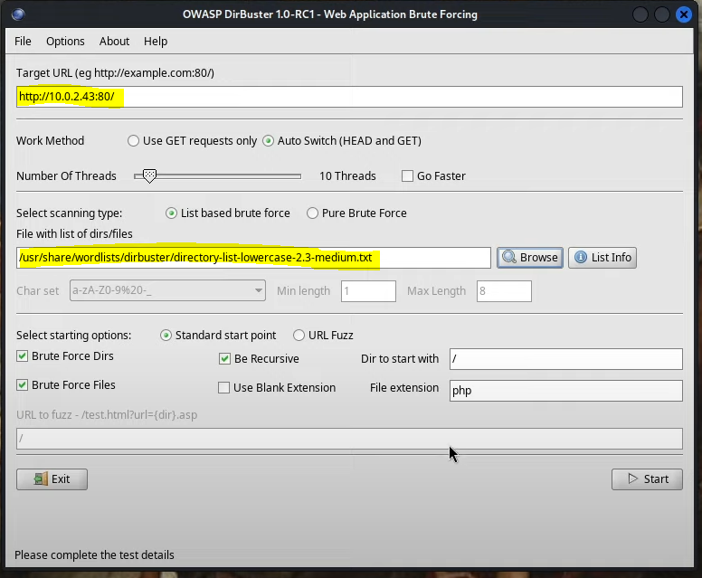
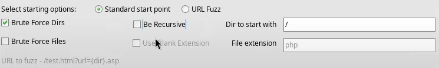

# FUZZING WEB

## REFERENCIAS WEB
+ https://www.yeswehack.com/learn-bug-bounty/parameter-discovery-quick-guide-to-starti

## ¿QUÉ ES EL FUZZING?
El fuzzing web es una técnica automatizada que consiste en
enviar grandes cantidades de peticiones con entradas
inesperadas o no documentadas a una aplicación web, con el
objetivo de descubrir recursos ocultos, parámetros, endpoints y
comportamientos anómalos.  Los softwares de fuzzing utilizan
diccionarios o listas de prueba para generar peticiones HTTP y
analizan las respuestas del servidor, no solo para identificar
recursos existentes, sino también para detectar diferencias de
comportamiento, errores o validaciones deficientes.

## CONTENT DISCOVERY
Content discovery se refiere a la enumeración de recursos web
accesibles no enlazados directamente, como directorios,
archivos o endpoints.

Para realizar este tipo de enumeración podemos utilizar diferentes herramientas. 

**CONTENT DISCOVERY DE DIRECTORIOS CON GOBUSTER**
```bash
gobuster dir -u http://webejemplo.com/ -w /path/diccionario
```

**CONTENT DISCOVERY DE DIRECTORIOS CON WFUZZ**
```bash
wfuzz -c --hc=404 -w /path/diccionario http://webejemplo.com/FUZZ
```
A wfuzz hay que especificarle el punto de inserción del
diccionario mediante la palabra FUZZ.  Podemos filtrar o mejor
dicho, esconder resultados con una respuesta HTTP = 404 (not
found) mediante el argumento --hc=404.

**CONTENT DISCOVERY DE DIRECTORIOS CON DIRBUSTER**

Dirbuster es muy sencillo, escribimos la URL a la que queremos
realizar el content discovery en el apartado *Target URL*,
especificando el protocolo y el puerto.  Luego hemos de
especificar el diccionario a utilizar en el apartado *File with
list of dirs/files*.

Deberemos seleccionar la opción *Brute Force Dirs*.
Podremos escoger desde que directorio comenzar en *Dir to start with*

**DICCIONARIOS RECOMENDADOS**
Seclist Discovery Web-Content: https://github.com/danielmiessler/SecLists/tree/master/Discovery/Web-Content

Instalación rápida: 
```bash
sudo apt install -y seclist
```


## SUBDOMAIN DISCOVERY
Subdomain Discovery es la técnica de reconocimiento que
consiste en identificar subdominios válidos de un dominio
principal.

**ENUMERACIÓN DE SUBDOMINIOS CON WFUZZ**
```bash
wfuzz -c --hc=404 -w /path/diccionario -H "Host:FUZZ.dominioprincipal.com" -u ip-victima
```
Para evitar falsos positivos podemos fijarnos en que el output
no repita un numero de lineas (L) o palabras (W) en muchos
registros. Para evitar que nos muestre resultados con un numero
de lineas concreto podemos utilizar el argumento --hl=# (hidden
lines, siendo # el número que queremos ocultar).  Ejemplo
sencillo: Imagina que el output se llena de registros en los
que el número de linea siempre es 34, esto en principio podría
indicarnos que se estan dando falsos positivos. Para evitar
esto, "escondemos" los resultados cuyo número de líneas sea 34
con --hl=34  

**DICCIONARIOS RECOMENDADOS**
Seclist Discovery DNS: https://github.com/danielmiessler/SecLists/tree/master/Discovery/DNS

## PARAMETER DISCOVERY 
Parameter Discovery es una técnica de enumeración que consiste
en identificar parámetros válidos aceptados por una aplicación
web, mediante el envío automatizado de peticiones con distintos
nombres de parámetros y el análisis de las respuestas del
servidor.

**PARAMETER DISCOVERY CON ARJUN**
```bash
arjun -u http://dominio.com
```
Arjun es un script de python para enumearar parametros de un dominio. Por
defecto utiliza su propio diccionario, pero se puede concretar uno
personalizado.
Por defecto utiliza peticiones por GET, pero podemos especificar otro método con el argumento -m:
```bash
arjun -u http://dominio.com -m POST
```
Instalación y documentación: https://github.com/s0md3v/Arjun

**PARAMETER DISCOVERY CON PARAMSPIDER**
```bash
python3 paramspider.py -d <target_domain> –level high
``` 

Instalación y documentación: https://github.com/devanshbatham/ParamSpider


