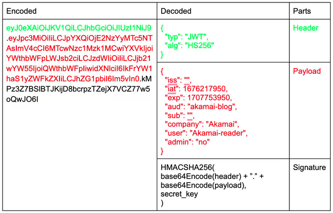

# TOKENS DE AUTENTICACIÓN

## ¿QUÉ ES?
Un token de autenticación es como un boleto que se le entrega a
un usuario después de verificar su identidad, y que le permite
acceder a distintos recursos sin tener que ingresar sus
credenciales en cada solicitud.

### JWT (JSON WEB TOKEN)
De entre todos los tipos de tokes de autenticación que existen, el más común a día de hoy es el JWT.

+ JWT es un estándar abierto que define un formato compacto y
  autocontenido para la transferencia segura de información
entre partes como un objeto JSON.
+ Se utiliza principalmente para la autenticación y
  autorización en aplicaciones web y servicios API.
+ Un JWT se compone de 3 partes:
    + **Encabezado (header)**: Contiene el tipo de token a
      utilizar y el algoritmo de firma a usar.
    + **Carga útil (payload)**: Contiene la información que se
      quiere trasmitir, como los claims (datos sobre el
usuario) y cualquier otra información adicional. Los claims
están codificados en JSON.
    + **Firma (signature)**: Se crea mediante la combinación
      del header + la carga útil (codificados en base64) + una
clave secreta. Se usa para verificar que el token no ha sido
alterado durante su transferencia. 

**VENTAJAS DEL JWT**

+ **Autenticación sin estado**: Al incluir la información de
  autenticación dentro del token, no es necesario mantener un
estado en el servidor. Esto es útil para aplicaciones
escalables y distribuidas.
+ **Interoperabilidad**: JWT es un estándar abierto, lo que
  significa que es compatible con una variedad de lenguajes de
programación y plataformas. 
+ **Seguridad**: Al estar firmado digitalmente, el token JWT
  garantiza que la información no ha sido alterada en el
camino. 

 

