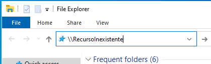
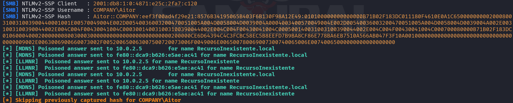
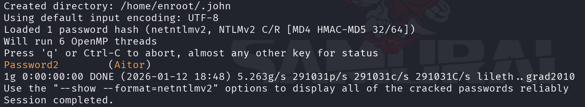

# PENTESTING EN ACTIVE DIRECTORY

### REFERENCIAS WEB
+ https://www.youtube.com/watch?v=-bNb4hwgkCo&t=2981s
+ https://angelica.gitbook.io/hacktricks/windows-hardening/active-directory-methodology

### LABORATORIO
+ Un DC (Domain Controller) con Windows 2016 Datacenter Eval Edition
+ Un usuario con Windows 10 Eval Edition
+ Todos en una misma red NAT

**Configurando el Domain Controller**

El DC será el servidor que funcionara como nodo central de nuestro directorio activo. 


Lo primero que vamos a hacer es cambiar el nombre del equipo para que sea más
sencillo identificarlo.  Esto por cierto no es una práctica aconsejable en un
entorno real. 
 


Desinstalamos el Windows Defender


Vamos a crear ahora el usuario a nível de directorio activo. 


**Configuración PC-User**


Tenemos que poner como servidor DNS la IP del DC.
 


Comprobamos como ahora tenemos conexión con el DC. 


Ahora vamos a añadir este pc al dominio. 


**Configuración de red**

Conectamos toda la red como red NAT con IPv6 habilitado.

## ATAQUES TÍPICOS

### SMB RELAY 
SMB relay es un ataque de tipo Man-in-the-Middle que consiste en hacerse pasar
por un recurso SMB legítimo para interceptar autenticaciones NTLM. Cuando un
usuario intenta acceder a un recurso por SMB, se realiza una resolución de
nombres. Si el nombre no existe, está mal escrito o el recurso está caído,
Windows puede recurrir a protocolos alternativos como LLMNR o NBT-NS. El
atacante responde a esa solicitud haciéndose pasar por el recurso, provocando
que la víctima intente autenticarse. La víctima envía una autenticación NTLMv2
(challenge–response), que no es necesario crackear, ya que puede ser
reutilizada en tiempo real para autenticarse contra otro servidor SMB,
permitiendo al atacante acceder a recursos haciéndose pasar por la víctima.

En SMB relay no se obtiene el hash NTLM de la contraseña, sino una respuesta
NTLMv2 dependiente del challenge, que no puede reutilizarse fuera de la sesión,
por lo que no se considera pass-the-hash.

IMPORTANTE: El ataque solo es posible si SMB signing está deshabilitado en el
servidor objetivo.

**Enumerar hosts con crackmapexec**

Podemos enumerar hosts mediante smb con crackmapexec
```bash
crackmapexec smb 10.10.10.0/24
```

**Responder**

https://github.com/SpiderLabs/Responder

Responder es una utilidad contruida en Python3 para realizar SMB Relay. Su uso
es muy sencillo, podemos acceder a su archivo de configuración Responder.conf y
poner en ON todos los protocolos que queremos tener en cuenta para el ataque.
Una vez configurado, lo lanzamos:

```bash
sudo python3 Responder.py -I eth0 -ws
``` 
Una vez el responder conectado, solo hay que esperar que un usuario traté de
acceder a un recurso que no este disponible.
 




Aunque no es necesario, puedes crackear el hash con john. 
´´´bash
john --wordlist=/usr/share/wordlists/rockyou.txt hashes.txt
´´´



### NTLM RELAY
Una forma de obtener la SAM de un host remoto es mediante un ataque de NTLM
relay. Si se da la condición de que un equipo del dominio tiene privilegios de
administrador sobre otro y el host objetivo no tiene SMB signing habilitado, es
posible interceptar una autenticación NTLM. Para ello, se puede levantar un
servidor SMB malicioso (por ejemplo con ntlmrelayx), esperando a que el equipo
con privilegios intente autenticarse contra un recurso inexistente. La
autenticación NTLM capturada se relaya en tiempo real contra el host objetivo,
autenticándonos como la víctima y permitiendo ejecutar acciones con privilegios
administrativos, como el volcado de la SAM.


**Crackmapexec para autenticarse**

Con la credencial robada podemos autenticarnos en smb desde crackmapexec.

```bash
crackmapexec smb 10.10.10.0/24 -u "Aitor" -p "Password2"
```

**Dumpear SAM con credenciales**

Si conseguimos robar un NTLM hash de un administrador y crackearlo podemos
obtener toda la sam con crackmapexec: 

```bash
crackmapexec smb 10.0.2.0/24 -u "Administrador" -p "Password1" --sam
```


