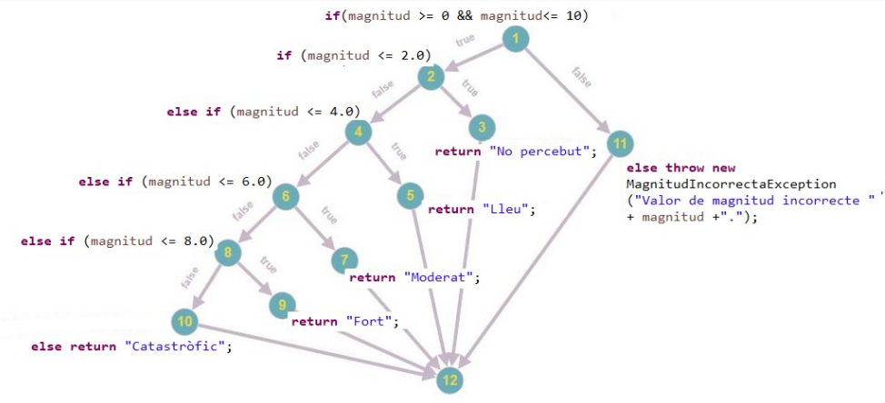

# PRUEBAS DE PROGRAMACIÓN

### UNITARIAS

Las pruebas unitarias (unit tests) son pruebas que verifican que una unidad
pequeña de código funcione correctamente.

Una unidad suele ser: 
+ Un método
+ Una función
+ Una clase (si es sencilla)

La idea es probar cada parte de forma aislada, sin depender de bases de datos,
APIs externas, ni otros componentes complejos.

**Objetivos**

+ Detectar errores temprano
+ Asegurar que el código hace lo que se espera
+ Facilitar cambios y refactorizaciones
+ Documentar el comportamiento del código
+ Aumentar la confianza al programar

**Ejemplo**

Tenemos este método:
```java
public int sumar(int a, int b) {
    return a + b;
}
```
Una prueba unitaria sería como:
```java
@Test
void deberiaSumarDosNumeros() {
    int resultado = calculadora.sumar(2, 3);
    assertEquals(5, resultado);
}
```
**Tabla explicativa**

|Cuando         |Qué                        |Enfoque           |Quien          |
|:-------------:|:-------------------------:|:----------------:|:-------------:|
|Desarrollo     |Métodos, funciones, clases |Caja blanca/negra |programadores  |

### FUNCIONALES

Las pruebas funcionales (functional tests) son pruebas que verifican que el
sistema cumple con los requisitos funcionales esperados, es decir, que las
funcionalidades se comportan correctamente desde el punto de vista del usuario
o del negocio.

No se enfocan en cómo está implementado el código, sino en qué hace el
sistema.

Una prueba funcional suele verificar:

+ Casos de uso
+ Reglas de negocio
+ Flujos completos de una funcionalidad
+ Entradas y salidas esperadas
+ La idea es probar el comportamiento del sistema como una caja negra, usando
interfaces públicas (API, UI, servicios).

**Objetivos**

+ Verificar que los requisitos funcionales se cumplen
+ Detectar errores en la lógica de negocio
+ Validar flujos completos
+ Asegurar que el sistema responde correctamente ante entradas válidas e inválidas
+ Simular el comportamiento real del usuario

**Ejemplo**

Supongamos una API que crea usuarios.

Endpoint:
```java
POST /api/users
```

Prueba funcional
```java
@Test
void deberiaCrearUnUsuarioCorrectamente() {
    UserRequest request = new UserRequest("Juan", "juan@mail.com");

    Response response = given()
        .contentType("application/json")
        .body(request)
        .when()
        .post("/api/users");

    response.then()
        .statusCode(201)
        .body("name", equalTo("Juan"))
        .body("email", equalTo("juan@mail.com"));
}
```

**Tabla explicativa**

|Cuando         |Qué                              |Enfoque           |Quien          |
|:-------------:|:-------------------------------:|:----------------:|:-------------:|
|Desarrollo     |Implementación requisitos usuario|Caja negra        |analistas QA   |

### INTEGRACIÓN

Las pruebas de integración (integration tests) son pruebas que verifican que
múltiples componentes del sistema funcionen correctamente juntos.

A diferencia de las pruebas unitarias, aquí no se prueban unidades aisladas,
sino la interacción entre capas o módulos (por ejemplo: controlador–servicio–
repositorio).

Una prueba de integración suele verificar:

+ Comunicación entre componentes
+ Integración entre capas (web, negocio, datos)
+ Configuración del framework
+ Acceso a base de datos (real o embebida)
+ Serialización y deserialización de datos

La idea es probar que las piezas del sistema están bien conectadas y
configuradas.

**Objetivos**

+ Detectar errores en la integración de componentes
+ Verificar configuraciones (Spring, beans, mapeos)
+ Asegurar que los datos fluyen correctamente entre capas
+ Detectar problemas que no aparecen en pruebas unitarias
+ Validar el comportamiento real del sistema a nivel técnico

**Ejemplo**

Supongamos una aplicación Spring Boot con base de datos.

Prueba de integración:
```java
@SpringBootTest
@AutoConfigureMockMvc
class UserIntegrationTest {

    @Autowired
    private MockMvc mockMvc;

    @Test
    void deberiaGuardarYRecuperarUnUsuario() throws Exception {
        mockMvc.perform(post("/api/users")
                .contentType(MediaType.APPLICATION_JSON)
                .content("""
                    {
                      "name": "Ana",
                      "email": "ana@mail.com"
                    }
                """))
            .andExpect(status().isCreated());

        mockMvc.perform(get("/api/users"))
            .andExpect(status().isOk())
            .andExpect(jsonPath("$[0].name").value("Ana"));
    }
}
```
En este caso:
+ Se levantan varios componentes de Spring
+ Se usa la configuración real
+ Se prueba el flujo completo entre capas

**Tabla explicativa**

|Cuando         |Qué                              |Enfoque           |Quien          |
|:-------------:|:-------------------------------:|:----------------:|:-------------:|
|Desarrollo     |Relacion interficies/componentes |Caja blanca/gris  |Programadores  |

### PRUEBAS DE SISTEMAS

Las pruebas de sistemas (system testing) son pruebas que verifican el
funcionamiento del sistema completo, ya integrado, en un entorno lo más
parecido posible al real.

Aquí se prueba la aplicación como un todo, no componentes individuales ni
relaciones internas, sino el comportamiento global del sistema.

Una prueba de sistemas suele verificar:

+ El sistema completo ya integrado
+ Flujos end-to-end
+ Requisitos funcionales y no funcionales
+ Comportamiento desde el punto de vista del usuario
+ Interacción con sistemas externos (si aplica)

La idea es validar el sistema en su conjunto, sin conocer su implementación
interna (caja negra).

**Objetivos**

+ Verificar que el sistema cumple los requisitos definidos
+ Validar el comportamiento global de la aplicación
+ Detectar fallos que no aparecen en pruebas unitarias o de integración
+ Evaluar el sistema en un entorno similar a producción
+ Asegurar que el sistema está listo para validación o aceptación

**Ejemplo**

Supongamos una aplicación web de compras.

Pruebas de sistemas:

1. El usuario inicia sesión
2. Busca un producto
3. Lo añade al carrito
4. Realiza el pago
5. Recibe confirmación de la compra

Aquí:

+ Se prueba todo el sistema
+ Intervienen frontend, backend, base de datos y servicios externos
+ No se prueba código interno, solo el comportamiento final

**Tabla explicativa**

|Cuando         |Qué                              |Enfoque           |Quien          |
|:-------------:|:-------------------------------:|:----------------:|:-------------:|
|Desarrollo     |Completar los requisitos         |Caja negra        |analistas QA   |

### PRUEBAS DE CARGA

Las pruebas de carga (load testing) son pruebas que verifican el
comportamiento del sistema bajo una carga esperada de usuarios o peticiones,
con el objetivo de evaluar su rendimiento y estabilidad.

Estas pruebas buscan medir cómo responde el sistema cuando muchos usuarios lo
utilizan al mismo tiempo, sin llevarlo al límite máximo.

Una prueba de carga suele verificar:

+ Tiempo de respuesta
+ Consumo de recursos (CPU, memoria)
+ Capacidad de procesamiento
+ Comportamiento con múltiples usuarios concurrentes
+ Estabilidad del sistema bajo condiciones normales de uso

La idea es comprobar que el sistema soporta la carga prevista sin degradar su
funcionamiento.

**Objetivos**

+ Evaluar el rendimiento del sistema
+ Detectar cuellos de botella
+ Verificar que los tiempos de respuesta son aceptables
+ Asegurar la estabilidad bajo carga normal
+ Validar requisitos no funcionales de rendimiento

**Ejemplo**

Supongamos una API REST.

Escenario de prueba de carga:
- 500 usuarios concurrentes
- Cada usuario realiza 10 peticiones por minuto
- Endpoint: GET /api/products
- Duración: 15 minutos

Resultados esperados:
+ Tiempo de respuesta medio < 2 segundos
+ Sin errores HTTP 5xx
+ Uso de CPU estable

|Cuando             |Qué                              |Enfoque           |Quien          |
|:-----------------:|:-------------------------------:|:----------------:|:-------------:|
|Después desarrollo |Rendimiento e integridad datos   |Caja negra        |analistas QA   |

### ACEPTACIÓN

Las pruebas de aceptación (acceptance testing) son pruebas que verifican que el
sistema cumple con los requisitos del cliente o del negocio y que, por tanto,
puede ser aceptado oficialmente.

Estas pruebas determinan si el sistema está listo para ser entregado o puesto
en producción.

Una prueba de aceptación suele verificar:

+ Requisitos del cliente
+ Criterios de aceptación
+ Casos de uso reales
+ Reglas de negocio acordadas
+ Expectativas del usuario final

La idea es validar el sistema desde el punto de vista del cliente, sin
considerar detalles técnicos de implementación (caja negra).

**Objetivos**

+ Confirmar que el sistema satisface las necesidades del cliente
+ Verificar que los requisitos definidos se cumplen
+ Detectar desviaciones respecto a lo acordado
+ Decidir si el sistema puede ser entregado
+ Reducir el riesgo de rechazo del producto

**Ejemplos**

Supongamos un requisito:

> “El usuario debe poder registrarse con un email válido y recibir un correo de
confirmación.”

Prueba de aceptación:
1. El usuario introduce un email válido
2. Completa el formulario de registro
3. El sistema crea la cuenta
4. El usuario recibe el correo de confirmación

**Tabla explicativa**

|Cuando             |Qué                              |Enfoque           |Quien
|:-----------------:|:-------------------------------:|:----------------:|:-------------:|
|Después desarrollo |Aceptacion por parte de los users|Caja negra        |Cliente        |

### PRUEBAS DE SISTEMA

Las pruebas de sistema (system test en algunos contextos de hardware/software)
son pruebas que verifican que el sistema operativo, hardware o entorno de
ejecución funciona correctamente y soporta las aplicaciones que se van a
ejecutar.

Estas pruebas no se enfocan en la lógica de negocio del software desarrollado,
sino en:

+ Configuración del entorno
+ Disponibilidad y compatibilidad del hardware
+ Funcionamiento del sistema operativo
+ Librerías y dependencias críticas
+ Integridad de servicios del sistema

La idea es garantizar que el entorno donde corre el software es estable y
confiable.

**Objetivos**

+ Verificar compatibilidad del software con el entorno
+ Detectar fallos del sistema operativo o hardware antes de producción
+ Confirmar que los recursos del sistema (CPU, memoria, red) funcionan correctamente
+ Validar dependencias críticas del entorno
+ Reducir riesgos de fallos de infraestructura

**Ejemplos**

Supongamos que vamos a desplegar un servidor de aplicaciones:

Prueba de sistema:
1. Verificar versión de sistema operativo
2. Confirmar que el servidor tiene suficiente memoria y CPU
3. Comprobar que el disco tiene espacio suficiente
4. Validar que las librerías necesarias están instaladas
5. Ejecutar un script de prueba para confirmar que servicios básicos funcionan

Resultado esperado:

+ El sistema operativo responde correctamente
+ Recursos disponibles cumplen los requisitos mínimos
+ Librerías y servicios requeridos están operativos

**Tabla explicativa**

|Cuando             |Qué                              |Enfoque           |Quien          |
|:-----------------:|:-------------------------------:|:----------------:|:-------------:|
|En producción      |Integración sistema con UI       |Caja negra        |analistas QA   |

### PRUEBAS DE REGRESIÓN

Las pruebas de regresión (regression testing) son pruebas que verifican que
cambios recientes en el software (correcciones, nuevas funcionalidades o
actualizaciones) no hayan introducido errores en funcionalidades existentes.

Se enfocan en mantener la estabilidad del sistema a lo largo del tiempo,
asegurando que lo que antes funcionaba siga funcionando.

Una prueba de regresión suele verificar:

+ Funcionalidades previamente probadas
+ Casos de uso críticos
+ Integridad del sistema después de cambios
+ Efectos secundarios de nuevas implementaciones
+ Comportamiento histórico del software

La idea es repetir pruebas anteriores para detectar regresiones y errores
inesperados.

**Objetivos**

+ Garantizar que nuevas modificaciones no rompan funcionalidades existentes
+ Detectar errores no intencionados introducidos por cambios recientes
+ Asegurar la estabilidad y calidad continua del sistema
+ Facilitar la entrega frecuente de software confiable
+ Reducir riesgos al actualizar aplicaciones

**Ejemplo**

Supongamos que agregamos un nuevo endpoint a una API de usuarios:

Nuevo endpoint: GET /api/users/active

Prueba de regresión:
1. Se ejecutan pruebas existentes de GET /api/users
2. Se ejecutan pruebas de POST /api/users
3. Se valida que ambos endpoints siguen funcionando correctamente
4. Se verifica que la nueva funcionalidad GET /api/users/active funciona

Resultado esperado:

+ Todos los endpoints antiguos funcionan como antes
+ La nueva funcionalidad está operativa
+ No hay errores introducidos por cambios recientes

|Cuando         |Qué                        |Enfoque           |Quien          |
|:-------------:|:-------------------------:|:----------------:|:-------------:|
|Lo último      |Errores nuevos tras cambios|Caja blanca/negra |analistas QA   |

## DISEÑO DE CASOS DE PRUEBA

**Paso 1 (Que probar)**

Identificar aquello que queremos probar.
Por ejemplo, queremos probar un método concreto, una prueba unitaria. 

Ejemplo. Tenemos el siguiente código y queremos poner a prueba el método
nivellRisc.
```java
// Fitxer RiscTerratremol.java
package terratremol;
public class RiscTerratremol {
    public static String nivellRisc(double magnitud)
                                    throws MagnitudIncorrectaException{
        if(magnitud >= 0 && magnitud<= 10) {
        if (magnitud <= 2.0) return "No percebut";
        else if (magnitud <= 4.0) return "Lleu";
        else if (magnitud <= 6.0) return "Moderat";
        else if (magnitud <= 8.0) return "Fort";
        else return "Catastròfic";
    }
    else throw new MagnitudIncorrectaException("Valor de magnitud
incorrecte "+ magnitud +".");
    }
}
// Fitxer MagnitudIncorrectaException.java
package terratremol;
@SuppressWarnings("serial")
public class MagnitudIncorrectaException extends Exception {
    public LMagnitudIncorrectaException (String missatge) {
            super(missatge);
    }
}
```

**Paso 2 (Identificar condiciones)**

Identificar las condiciones, restricciones y contenido de las entradas y
salidas.

Condiciones:
+ Entrada: El nivel de riesgo ha de ser un double entre 0 y 10, ambos
  incluidos.
+ Salida: 
    + Si el valor de la lectura de aire en inferior a 0 o superior a 10, se
      lanza excepción
    + En caso contrario, se retorna un String con un adjetivo descriptivo del
      nivel de riesgo

**Paso 3 (Definir clases de equivalencia)**

Ahora con estas condiciones identificadas, identificamos las clases de equivalencia
Las clases de equivalencia son grupos de entradas que se comportan de la misma
manera respecto al sistema.  La idea es reducir la cantidad de pruebas, sin
perder cobertura.
> Si un valor de la clase funciona, todos los demás de esa clase deberían
> funcionar igual.

Ahora veamos las consideraciones para los valores de entrada. 
En nuestro caso, el método nos pide un valor entre 0 y 10.

Consideraciones: 
+ Hay un rango de datos válido y dos invalidos. (rango válido de 0 <= magnitud
  \>= 10 e inválido magnitud < 0 y magnitud > 10)
+ Los datos que van del 0 al 2 se comportan igual.
+ Los datos que van del 2 al 4 se comportan igual.
+ Los datos que van del 4 al 6 se comportan igual.
+ Los datos que van del 6 al 8 se comportan igual.
+ Los datos que van del 8 al 10 se comportan igual.
+ Todos los datos fuera de rango (0 <= magnitud >= 10) se comportan igual.

Por lo tanto, las clases de equivalencia serían:
1. magnitud < 0 [inválida]
2. magnitud > 10 [inválida]
3. magnitud >=0 y magnitud <=2 [válida]
4. magnitud >=2 y magnitud <=4 [válida]
5. magnitud >=4 y magnitud <=6 [válida]
6. magnitud >=6 y magnitud <=8 [válida]
7. magnitud >=8 y magnitud <=10 [válida]

**Escoger un valores representativos**

Ahora vamos a escoger valores concretos de cada clase. 
Debemos escoger el valor mínimo, el intermedio y los errores tipicos.

Ejemplo:

|clase    |Tipo         |Valor representativo|
|:-------:|:-----------:|:------------------:|
|1        |inválida     |-1, -1000000000     |
|2        |inválida     |11, 99999999999     |
|3        |válida       |0, 1, 2             |
|4        |válida       |2, 3, 4             |
|5        |válida       |4, 5, 6             |
|6        |válida       |6, 7 , 8            |
|7        |válida       |8, 9, 10            |

**Dibujar el diagrama de flujo**

Ahora vamos a dibujar todos los caminos posibles que puede hacer el método.



**Escribir caminos independientes**

Ahora que tenemos el diagrama de flujo vamos a apuntar todos los caminos
posibles.

+ 1-11-12
+ 1-2-3-12
+ 1-2-4-5-10
+ 1-2-4-6-7-10
+ 1-2-4-6-8-9-12
+ 1-2-4-6-8-10-12

**Calcular complejidad ciclomática**

Podemos saber el número de caminos posibles con esta formula:

```
cc = complejidad ciclomática
número ramas = nr
número nodos = nn

cc = nr - nn + 2
```
Por ejemplo, en nuestro caso. 

```
nr = 16
nn = 12

cc = 16 - 12 + 2
cc = 6 
```
Y tal cual son 6 caminos.


 
