# DIAGRAMAS UML

## ¿QUÉ ES UML?

### REFERENCIAS WEB
+ https://www.youtube.com/watch?v=orvAkFFWo5o
### DIAGRAMA DE CLASES
Captura la estructura estática del sistema, mostrando las clases y las
relaciones entre ellas.

**Clases**

Describe un grupo de objetos con estructura y comportamiento similares.

 

La notación se compone de un rectangulo vertical con 3 compartimentos.
En el compartimento superior encontramos el nombre de la clase (debe ser
descriptivo).  
En el segundo los atributos, junto con el tipo de dato.
En el tercero los métodos.

UML permite mostrar la visibilidad de los atributos y los métodos con una
notación de (-) y (+), siendo estos privados y públicos respectivamente.

**Relaciones**

En un diagrama de clases las clases se relacionan entre ellas.

+ Asociación 

Es una relación estructural entre clases que especifica que los objetos de una
clase están conectados con los objetos de otra clase.

Esta relación se representa con una linea que une ambas clases y con un nombre
que describe la relación.

En el ejemplo de la imagen, vemos una relación de asociación entre las clases
persona y compañia. En este caso, observamos que una persona trabaja-para 1..N
(1 o más) Compañias. Y que una Compañia emplea-a * (ninguna o muchas personas).
1..N y \* son **cardinalidades**, estas representan cuanto de cada clase se
relaciona con la otra.
Su notación es la siguiente:

    + 1..1 (Una a una)
    + 1..N (Una a muchas)
    + 0..* (Cero a muchas)
    + N..M (Muchas a muchas)
La cardinalidad se pone en el lado de la clase con la que se relaciona, es
decir, si una PERSONA trabaja en una o muchas COMPAÑIAs, la cardinalidad se
pone en el lado de COMPAÑIA.   

Una clase también puede relacionarse consigo misma, en **Autoasociación**.  Una
clase se relaciona consigo misma cuando sus propios objetos interactúan, se
contienen o se vinculan entre ellos. 

En el caso de ejemplo vemos como la clase Persona se relaciona consigo misma
con la relación administra. El jefe administa al empleado, tanto jefe como
empleado son objetos de la clase persona.

Las relaciones en sí también pueden tener atributos. Estos son conocidos como
**Atributos de enlace** 
Estos atributos de enlace, a su vez, pueden convertirse en clases, de tal manera que pasan a llamarse **Clases de asociación**

 
+ Agregación

Es una asociación con más semántica. La relación entre clases es "está formado por".
Se representa con un rombo en la parte que representa el compuesto.
No hace falta darle un nombre a la relación.

En el ejemplo Compañia (compuesto) y departamento (componente) tienen un
relación de agregación puesto que una Compañia esta FORMADA por 1..N (uno o
varios) Departamentos, y el Departamento forma parte de 0..N (Ninguna o muchas)
compañias. 

Existen dos tipos de relaciones de agregación: 
    + Agregación referencial: Los componentes son reutilizbles por distintos
      compuestos.
    + Agregación inclusiva: Un componente sólo puede pertenecer a un compuesto.
      La destrucción del compuesto implica la destrucción de sus componentes. 
Cuando hacemos una agregación inclusiva lo que realmente estamos haciendo es una relación entre clases tipo "está compuesto por". También llamada composición.

Esto se leería como, la Compañia esta compuesta por 1..N (Uno o varios) Departamentos. 
Se asume que si eliminaramos Compañia, eliminariamos consecuentemente sus Departamentos. 

+ Especialización/Generalización

Permite definir jerarquías de clases. La relación entre clases es "es un"
(Herencia)
Se representan mediante flechas triangulares que van de los hijos al padre o
superclase.

A este tipo de relación la llamamos de especialización, si recorremos la
jerarquía desde la superclase hasta clases más especializadas o de
generalización si lo hacemos del revés, de las clases más especializadas a la
superclase.

En la Especialización/Generalización podemos (no es obligatorio) agregar unas
etiquetas para definir si la relación es: 
    + Completa/Incompleta: Se han definido todas las sublaclases/No se han
      definido todas las subclases
    + Disjunta/Dinámica: Excluyentes/ no excluyentes.

Por ejemplo, en la imagen, por completa nos referimos a que se han especificado
todas las subclases de Persona (Hombre, Mujer) y por disjunta estamos señalando
que un objeto de la clase Persona puede ser Hombre o Mujer, pero no ambas a la
vez, es excluyente.

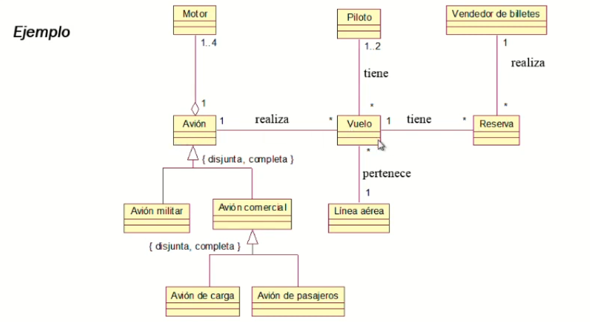

Ejemplo completo. 

### DIAGRAMA DE CASOS DE USO
Sirven para modelar el comportamiento de un sistema.
Capturan los requisitos funcionales del sistema a desarrollar. 

Se representan mediante un recuadro (el sistema) donde encapsulamos los
requisitos o funcionalidades y fuera del recuadro se representan los actores
(los que interactuan con el sistema).

En este ejemplo vemos un recuadro que representa el sistema, en este caso un
restaurante.  Dentro del recuadro se representan las funcionalidades y/o
necesidades del sistema.  Y fuera de este los actores que interactuan con el.

Estos casos de uso se pueden describir mediante plantillas con lenguaje natural. 

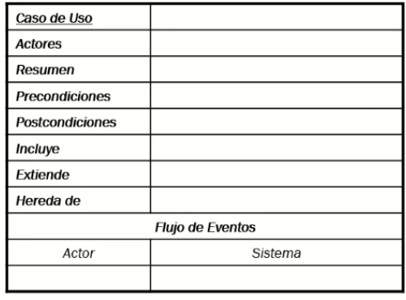

Las relaciones entre casos de uso pueden ser:

+ Inclusión

Un caso de uso A incluye a un caso de uso B, si una instancia (un objeto de) A
puede realizar todos los eventos que aparecen descritos en B. 

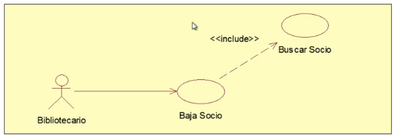

En el ejemplo, Baja socio incluye a buscar socio. Esto significa que siempre
que se ejecute Baja socio se tiene que ejecutar Buscar socio.  Esto se
representa mediante una linea discontinua que une ambos casos de uso y la
palabra \<\<include\>\>

    
+ Extensión

Un caso de uso B extiende a un caso de uso A, si en la descripción de A figura
una condición cuyo cumplimiento origina la ejecución de todos los eventos que
aparecen descritos en B.

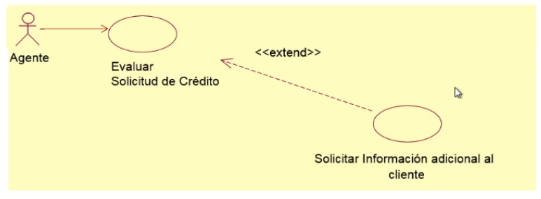

En el ejemplo, el caso de uso Solicitar información adicional del cliente
extiende a Evaluar solicitud de crédito solo cuando se cumpla una condición
especifica. Dicha condición no se pone en el diagrama sino en la plantilla. 

Por ejemplo: 

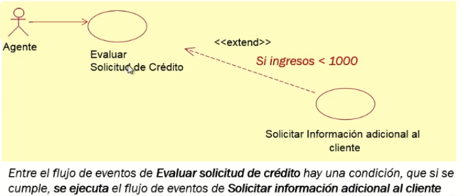

+ Herencia

La herencia es una especialización de casos de uso.  Un caso de uso B
especializa a un caso de uso A, si el flujo de eventos de B es un refinamiento
del flujo de eventos de A. 

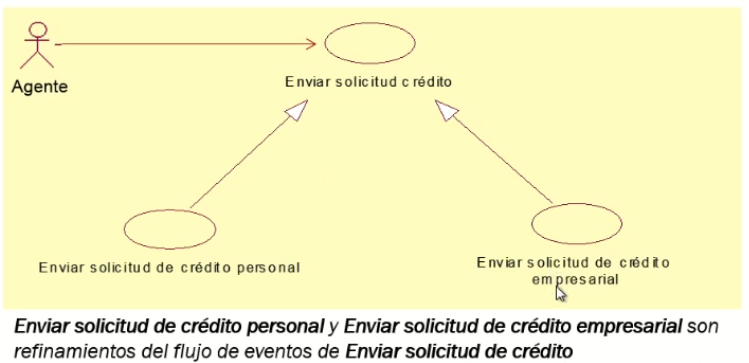

En el ejemplo, Enviar solicitud de crédito personal y Enviar solicitud de
crédito empresarial son especificaciones de un caso de uso más generalizado que
es Enviar solicitud de crédito. 

También se puede aplicar la herencia a los actores, donde un actor descendiente
puede jugar todos los roles del actor antecesor. 

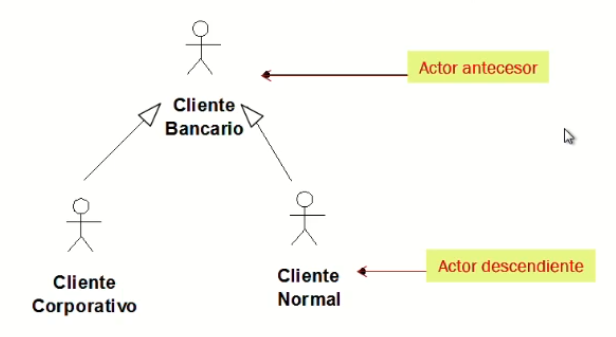

### DIAGRAMA DE SECUENCIA
Un diagrama de secuencia modela la interacción entre los objetos/actores de
nuestro sistema, identificando la comunicación (mensajes) entre los mismos y
las operaciones (métodos) de las clases para resolver un servicio.

+ Se debe identificar el emisor y el receptor
+ El orden de los mensajes/eventos es importante, pues representa el orden de
  la secuencia
+ Se describe el ciclo de vida de los objetos

Ejemplo:

**Construir un diagrama de secuencia**

Vamos a tomar como ejemplo el siguiente caso: El administrador desea listar
todos los cursos de una escuela de verano que ha ofertado un administrador con
un DNI dado (por ejemplo, el administrador con DNI "12345678A"). Nos interesa
conocer, además de la información completa del curso, su fecha de inserción en
el sistema y el número de reservas que tiene dicho curso.

Para ello podemos partir de un diagrama de clases como el siguiente (no es
obligatorio):

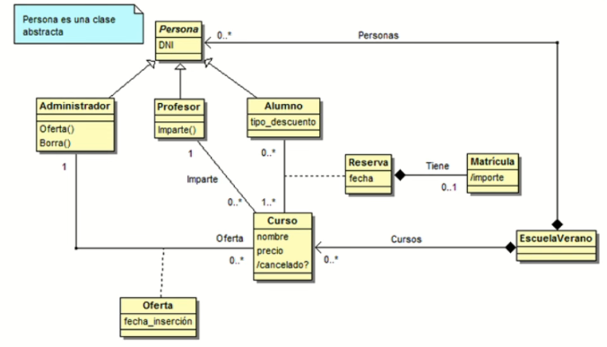

1. Identificamos el actor iniciador y el controlador (objeto
   principal) de nuestro sistema

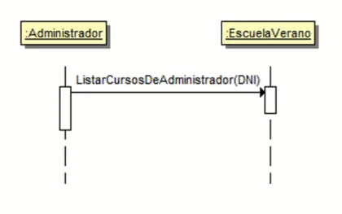

Identificamos el actor iniciador, en este caso el Administrador.  El primer
mensaje es la operación, es decir, el caso de uso que queremos resolver. Y como
parámetro le introducimos el String DNI, esto no es estrictamente obligatorio,
pero cuanto más completo sea nuestro módelo, mejor. 
Luego identificamos el objeto principal o controlador, es decir, donde sucede la acción. 
En este caso, Escuela de verano. 

2. Representamos la comunicación entre el actor y el controlador y empezamos a
   iterar sobre los objetos

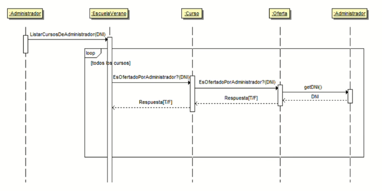

La secuencia es clara, el administrador trata de listar los cursos aportando un DNI.
Comienza el bucle. Representamos dicho bucle con un marco loop (introducido en UMLv2).
El objeto de EscuelaVerano le pregunta a Curso si este fue ofertado por administrador.
Este a su vez (Curso) le pregunta a Oferta y esta a su ves a Administrador. 
Como vemos existe una secuencia necesaria de "dependencias".

3. Una vez tenemos los objetos seguimos con la interacción

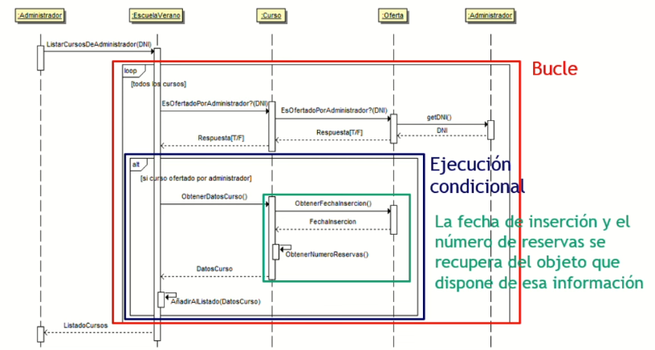

Una vez que tenemos todos los cursos "filtrados" es decir, que son de ese administrador, lo que tenemos que hacer es ofrecer una condición, esta condición se señala con el marco alt. Esta condición nos indica si el curso esta ofertado por el administrador, lo ofertamos, sino, no hacemos nada con dicho curso. 
Para saber si cumple dicha condición le preguntamos al curso.

### DIAGRAMA DE ACTIVIDADES
 

