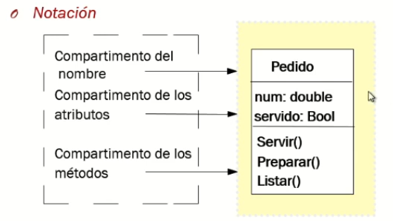
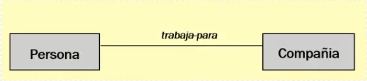
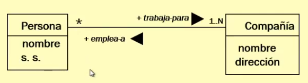
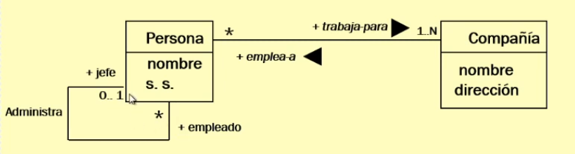
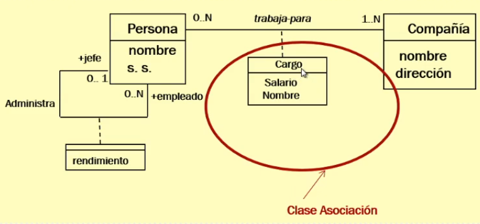
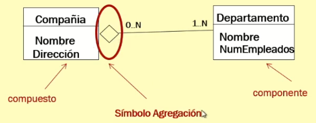
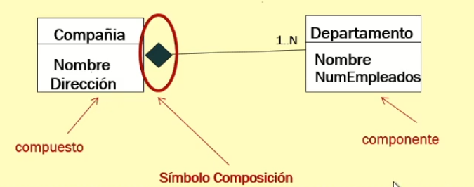
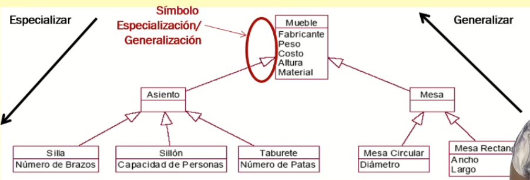
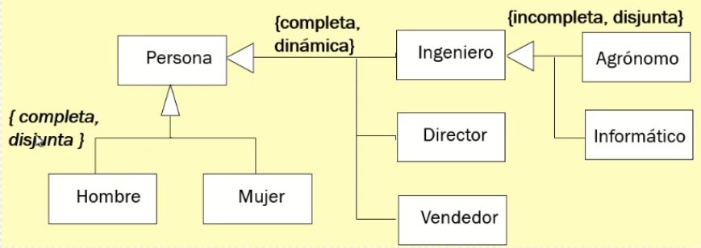

# DIAGRAMAS UML

## ¿QUÉ ES UML?

### DIAGRAMA DE CLASES
Captura la estructura estática del sistema, mostrando las clases y las
relaciones entre ellas.

**Clases**

Describe un grupo de objetos con estructura y comportamiento similares.

 

La notación se compone de un rectangulo vertical con 3 compartimentos.
En el compartimento superior encontramos el nombre de la clase (debe ser
descriptivo).  
En el segundo los atributos, junto con el tipo de dato.
En el tercero los métodos.

UML permite mostrar la visibilidad de los atributos y los métodos con una
notación de (-) y (+), siendo estos privados y públicos respectivamente.

**Relaciones**

En un diagrama de clases las clases se relacionan entre ellas.

+ Asociación: Es una relación estructural entre clases que especifica que los
  objetos de una clase están conectados con los objetos de otra clase.

Esta relación se representa con una linea que une ambas clases y con un nombre
que describe la relación.

En el ejemplo de la imagen, vemos una relación de asociación entre las clases
persona y compañia. En este caso, observamos que una persona trabaja-para 1..N
(1 o más) Compañias. Y que una Compañia emplea-a * (ninguna o muchas personas).
1..N y \* son **cardinalidades**, estas representan cuanto de cada clase se
relaciona con la otra.
Su notación es la siguiente:

    + 1..1 (Una a una)
    + 1..N (Una a muchas)
    + 0..* (Cero a muchas)
    + N..M (Muchas a muchas)
La cardinalidad se pone en el lado de la clase con la que se relaciona, es
decir, si una PERSONA trabaja en una o muchas COMPAÑIAs, la cardinalidad se
pone en el lado de COMPAÑIA.   

Una clase también puede relacionarse consigo misma, en **Autoasociación**.  Una
clase se relaciona consigo misma cuando sus propios objetos interactúan, se
contienen o se vinculan entre ellos. 

En el caso de ejemplo vemos como la clase Persona se relaciona consigo misma
con la relación administra. El jefe administa al empleado, tanto jefe como
empleado son objetos de la clase persona.

Las relaciones en sí también pueden tener atributos. Estos son conocidos como
**Atributos de enlace** 
Estos atributos de enlace, a su vez, pueden convertirse en clases, de tal manera que pasan a llamarse **Clases de asociación**

 
+ Agregación
Es una asociación con más semántica. La relación entre clases es "está formado por".
Se representa con un rombo en la parte que representa el compuesto.
No hace falta darle un nombre a la relación.

En el ejemplo Compañia (compuesto) y departamento (componente) tienen un
relación de agregación puesto que una Compañia esta FORMADA por 1..N (uno o
varios) Departamentos, y el Departamento forma parte de 0..N (Ninguna o muchas)
compañias. 

Existen dos tipos de relaciones de agregación: 
    + Agregación referencial: Los componentes son reutilizbles por distintos
      compuestos.
    + Agregación inclusiva: Un componente sólo puede pertenecer a un compuesto.
      La destrucción del compuesto implica la destrucción de sus componentes. 
Cuando hacemos una agregación inclusiva lo que realmente estamos haciendo es una relación entre clases tipo "está compuesto por". También llamada composición.

Esto se leería como, la Compañia esta compuesta por 1..N (Uno o varios) Departamentos. 
Se asume que si eliminaramos Compañia, eliminariamos consecuentemente sus Departamentos. 

+ Especialización/Generalización
Permite definir jerarquías de clases. La relación entre clases es "es un"
(Herencia)
Se representan mediante flechas triangulares que van de los hijos al padre o
superclase.

A este tipo de relación la llamamos de especialización, si recorremos la
jerarquía desde la superclase hasta clases más especializadas o de
generalización si lo hacemos del revés, de las clases más especializadas a la
superclase.

En la Especialización/Generalización podemos (no es obligatorio) agregar unas
etiquetas para definir si la relación es: 
    + Completa/Incompleta: Se han definido todas las sublaclases/No se han
      definido todas las subclases
    + Disjunta/Dinámica: Excluyentes/ no excluyentes.

Por ejemplo, en la imagen, por completa nos referimos a que se han especificado
todas las subclases de Persona (Hombre, Mujer) y por disjunta estamos señalando
que un objeto de la clase Persona puede ser Hombre o Mujer, pero no ambas a la
vez, es excluyente.

Ejemplo completo. 

### DIAGRAMA DE CASOS DE USO

